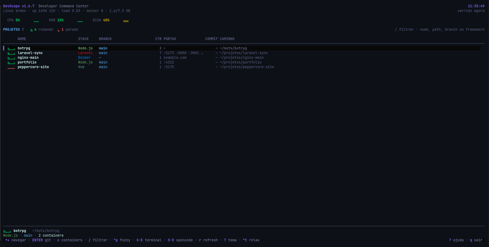
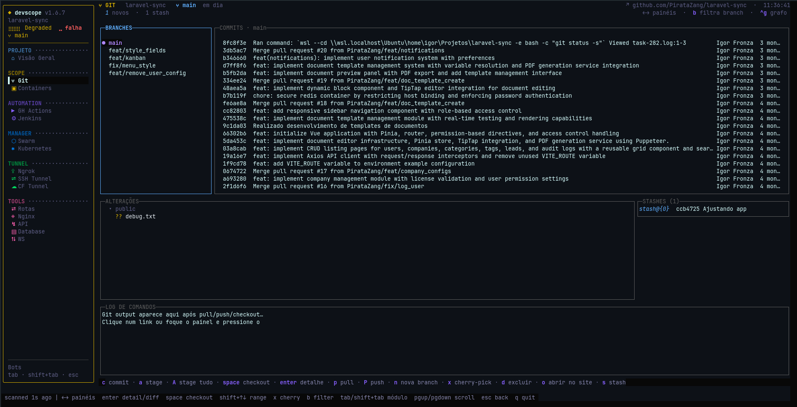
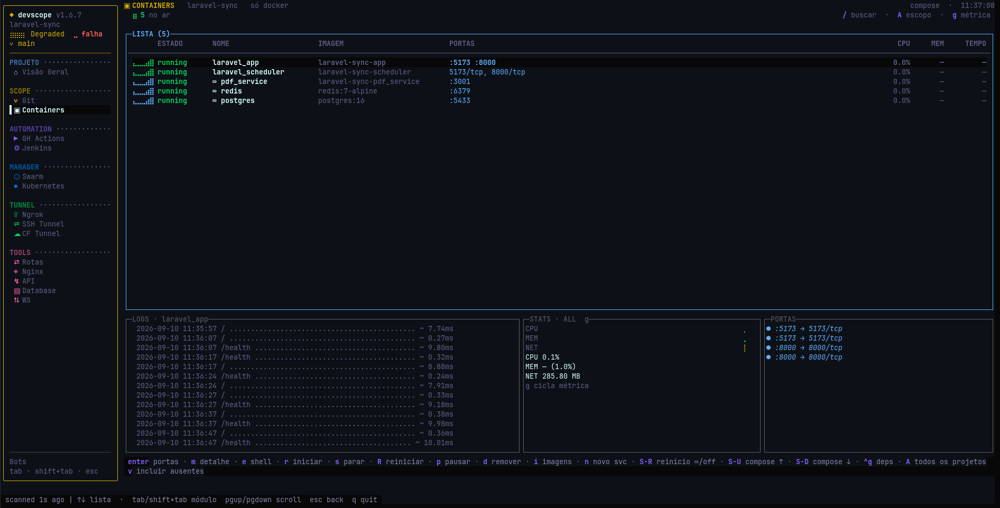
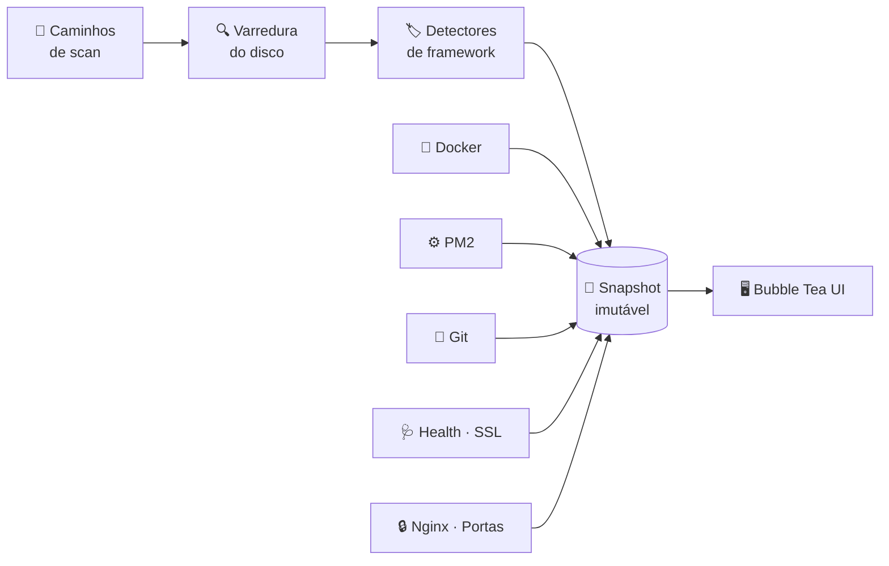

<div align="center">

# ◆ DevScope

### O `htop` dos seus projetos

Containers, Git, CI, túneis, banco e saúde de **todos** os seus projetos —
numa tela só, dentro do terminal.

<p>
  <a href="https://github.com/PirataZang/devscope/actions/workflows/ci.yml"></a>
  <a href="https://github.com/PirataZang/devscope/releases"></a>
  <a href="LICENSE"></a>
  
  
</p>

**[Instalar](#-instalação)** ·
**[Tour](#-um-tour-de-três-telas)** ·
**[Módulos](#-15-módulos-um-contexto)** ·
**[Preferências](#-preferências)** ·
**[Arquitetura](#-como-funciona)** ·
**[Docs](#-documentação)**

</div>

```
  ╭ DevScope v0.1.0  Developer Command Center                     CPU 4%  RAM 22%  DISK 40%   09:34:23
  │ Linux arm64 · up 149d 12h · load 0.03 · docker 8 · 1.6/7.3 GB                        varrido agora
  ├ PROJETOS 5   ⣷ 4 rodando  ⣄ 1 parado                   / filtrar · nome, path, branch ou framework
  │        NOME                    STACK     BRANCH             CTR COMMIT CAMINHO
  │ ──────────────────────────────────────────────────────────────────────────────────────────────────
  │ ▌ ⣷⣄⣀⡀ botrpg                  Node.js   main                 2      — ~/bots/botrpg
  │   ⣷⣄⣀⡀ laravel-sync            Laravel   main                 7      — ~/projetos/laravel-sync
  │   ⣷⣄⣀⡀ nginx-main              Docker    —                    1      — ~/projetos/nginx-main
  │   ⣷⣄⣀⡀ portfolio               Node.js   main                 1      — ~/projetos/portfolio
  │   ⣀⣀⣀⡀ peppercore-site         Vue       main                 1      — …projetos/peppercore-site
  │ ──────────────────────────────────────────────────────────────────────────────────────────────────
  │ ⣷⣄⣀⡀ botrpg   ~/bots/botrpg
  │ Node.js · main · 2 containers
  ╰  ↑↓ navegar · ENTER git · c containers · / filtrar · ^p fuzzy · S-E terminal     ? ajuda · q sair
```

<div align="center">
<sub><b>Uma linha por projeto:</b> estado animado · stack detectada · branch · containers · portas · caminho<br>
👇 as três telas em tamanho real logo abaixo, no <a href="#-um-tour-de-três-telas">tour</a></sub>
</div>

---

## ⚡ Em 30 segundos

<div align="center">
<table>
<tr>
<td width="25%" align="center">

### 📦
**Binário único**

Sem Node, sem Python,<br>sem daemon, sem browser

</td>
<td width="25%" align="center">

### 🔍
**Zero configuração**

Ele acha seus projetos<br>sozinho no disco

</td>
<td width="25%" align="center">

### ⚙️
**Opera, não só observa**

Subir, parar, commitar,<br>deploy, túnel, SQL

</td>
<td width="25%" align="center">

### 🧊
**Nunca trava**

Coleta concorrente,<br>UI sobre snapshot imutável

</td>
</tr>
</table>
</div>

---

## 🔥 O problema

Você trabalha em **projetos**. Suas ferramentas trabalham em outra unidade — processo,
container, serviço, repositório. Saber como está tudo, numa manhã de segunda, custa isso:

<table>
<tr>
<th width="50%">😩 Antes</th>
<th width="50%">😌 Depois</th>
</tr>
<tr>
<td valign="top">

```bash
docker ps -a                  # o que está de pé
docker stats --no-stream      # consumindo o quê
pm2 list                      # e os workers Node
git -C /var/www/api status     # o que ficou solto
gh run list                   # a pipeline passou
ss -ltn | grep LISTEN         # quem pegou a 8080
nginx -T | grep server_name   # que domínio é esse
certbot certificates          # e o SSL, vence quando
```

Oito comandos, oito formatos de saída — e **nenhum deles sabe**
que tudo aquilo é o mesmo projeto.

</td>
<td valign="top">

```bash
devscope
```

<br>

Um binário. Ele varre o disco, detecta a stack, correlaciona
containers, workers, portas, domínios e certificados **ao
projeto certo** — e deixa você operar tudo dali.

</td>
</tr>
</table>

---

## 🚀 Instalação

**🐧 Linux · 🍎 macOS**

```bash
curl -fsSL https://raw.githubusercontent.com/PirataZang/devscope/main/scripts/install.sh | bash
```

**🪟 Windows (PowerShell)**

```powershell
irm https://raw.githubusercontent.com/PirataZang/devscope/main/scripts/install.ps1 | iex
```

```bash
devscope               # abre a TUI
devscope scan --json   # snapshot da máquina em JSON, para automação
devscope watch         # painel com auto-refresh, sem TUI interativa
devscope version       # versão, commit e data de build
```

<details>
<summary><b>📥 Versão específica, diretório customizado, download manual e build from source</b></summary>

<br>

**Versão específica**

```bash
DEVSCOPE_VERSION=0.1.0 curl -fsSL https://raw.githubusercontent.com/PirataZang/devscope/main/scripts/install.sh | bash
```

```powershell
$env:DEVSCOPE_VERSION="0.1.0"; irm https://raw.githubusercontent.com/PirataZang/devscope/main/scripts/install.ps1 | iex
```

**Diretório de instalação**

```bash
DEVSCOPE_INSTALL_DIR=/usr/local/bin curl -fsSL https://raw.githubusercontent.com/PirataZang/devscope/main/scripts/install.sh | bash
```

```powershell
$env:DEVSCOPE_INSTALL_DIR="C:\Tools\devscope"; irm https://raw.githubusercontent.com/PirataZang/devscope/main/scripts/install.ps1 | iex
```

**Download direto** — binários em [Releases](https://github.com/PirataZang/devscope/releases),
cada um com `checksums.txt`:

| Plataforma | Arquivo |
|---|---|
| Linux x64 / ARM64 | `devscope_*_linux_amd64.tar.gz` · `devscope_*_linux_arm64.tar.gz` |
| macOS Intel / Apple Silicon | `devscope_*_darwin_amd64.tar.gz` · `devscope_*_darwin_arm64.tar.gz` |
| Windows x64 / ARM64 | `devscope_*_windows_amd64.zip` · `devscope_*_windows_arm64.zip` |

**Build from source** (Go 1.22+)

```bash
git clone https://github.com/PirataZang/devscope.git && cd devscope
make build        # binário em ./bin/devscope
make run          # compila e executa
make install-dev  # instala no PATH de desenvolvimento
```

Ou `go install github.com/devscope/devscope/cmd/devscope@latest` — com `$GOPATH/bin` no `PATH`.

</details>

---

## 🎬 Um tour de três telas

### 1. A lista de projetos

<p align="center">
  
</p>

> **O que olhar**
>
> 🌊 **A onda Braille** à esquerda de cada nome é o estado, animado — verde subindo é saudável,
> amarelo é atenção, vermelho baixo é parado. É a *altura* da onda que separa os estados, então
> continua legível em print, sem cor, e para quem enxerga cor de outro jeito.
>
> 📊 **A régua do host** no topo (CPU, RAM, disco) e o contador `4 rodando · 1 parado`.
>
> 🔎 <kbd>/</kbd> filtra ao vivo por nome, path, branch ou framework · <kbd>Ctrl</kbd>+<kbd>P</kbd>
> é a busca fuzzy · <kbd>Enter</kbd> entra no projeto.

<br>

### 2. Git, sem sair do lugar

<p align="center">
  
</p>

> **O que olhar**
>
> 🌿 **Branches e commits lado a lado**, alterações não commitadas e stashes — o repositório
> inteiro numa tela.
>
> 📝 **O log de comandos** mostra exatamente o `git` que o DevScope executou. Nada acontece
> escondido, e o link do PR fica clicável.
>
> ⌨️ <kbd>c</kbd> commit · <kbd>a</kbd> stage · <kbd>Space</kbd> checkout · <kbd>p</kbd> pull ·
> <kbd>Shift</kbd>+<kbd>P</kbd> push · <kbd>x</kbd> cherry-pick · <kbd>Ctrl</kbd>+<kbd>G</kbd>
> abre o **Git Graph**, o DAG desenhado no terminal.

<br>

### 3. Containers do projeto

<p align="center">
  
</p>

> **O que olhar**
>
> 🐳 **Só os containers daquele projeto** — a correlação é por mount path e label do compose.
> <kbd>Shift</kbd>+<kbd>A</kbd> mostra os de todos, com o nome do projeto alheio em amarelo.
>
> 📡 **Logs ao vivo, stats e o mapa de portas** na mesma tela, sem abrir outro terminal.
>
> 🔐 <kbd>m</kbd> abre o detalhe em **7 abas numeradas** (logs · métricas · env · config ·
> processos · compose · Dockerfile) com busca, rolagem lateral, realce por tipo de conteúdo e
> **mascaramento automático de segredos** no env — essa tela costuma aparecer em call e em print.

---

## 🧩 15 módulos, um contexto

<table>
<tr>
<td width="33%" valign="top">

#### 🏠 PROJETO
`Visão Geral`
> stack, saúde, containers,
> git e atividade num painel

#### 🟡 SCOPE
`Git` · `Containers`
> branches, commits, PR, graph
> start/stop, shell, logs, stats

</td>
<td width="33%" valign="top">

#### 🔵 AUTOMATION
`GH Actions` · `Jenkins`
> runs, workflows, logs, YAML,
> trigger, re-run, builds

#### 🐳 MANAGER
`Swarm` · `Kubernetes`
> services, nodes, stacks,
> pods, manifests, scale

</td>
<td width="33%" valign="top">

#### 🟢 TUNNEL
`Ngrok` · `SSH` · `CF Tunnel`
> expor o local, requests
> ao vivo, copiar URL

#### 🩷 TOOLS
`Rotas` · `Nginx` · `API`
`Database` · `WebSocket`
> endpoints, vhosts, HTTP,
> SQL e frames

</td>
</tr>
</table>

<div align="center">
<sub>

**Também no pacote:** health checks HTTP/TCP · validade de SSL (Let's Encrypt) · portas abertas ·
workers PM2 · `docker compose up/down/restart` · deploy com confirmação · 12 temas

</sub>
</div>

---

## 🎛️ Preferências

<kbd>Shift</kbd>+<kbd>C</kbd> abre o painel de preferências **dentro** do DevScope:

<table>
<tr>
<td width="34%" valign="top">

**🎨 Tema**

Uma lista que gira com
<kbd>←</kbd> <kbd>→</kbd> e aplica na
hora, entre 12 opções.

</td>
<td width="33%" valign="top">

**🔢 Atalhos**

Dez caixas de `nome` + `comando`
nas teclas <kbd>1</kbd>…<kbd>9</kbd> <kbd>0</kbd>.
`&` no fim abre solto.

</td>
<td width="33%" valign="top">

**🤖 Agente de IA**

O que o <kbd>Ctrl</kbd>+<kbd>O</kbd> abre.
Vazio = o primeiro do `PATH`.

</td>
</tr>
</table>

<kbd>Enter</kbd> salva e aplica sem reiniciar · <kbd>Ctrl</kbd>+<kbd>R</kbd> volta tudo ao padrão
(pede confirmação e guarda o anterior em `user_config.bak.txt`).

Tudo vai para `~/.config/devscope/user_config.txt`, um texto comentado que também dá para editar
à mão:

```yaml
Theme: dracula-vivid

Commands: {
  "1": {"name": "Abrir a pasta", "command": "xdg-open . &"},
  "2": {"name": "Obsidian",      "command": "obsidian &"},
  "3": {"name": "Lazygit",       "command": "lazygit"}
}

AI: claude
```

> 🛟 Deu errado? A cópia de fábrica fica ao lado, reescrita a cada abertura do painel:
> `cp ~/.config/devscope/user_config.default.txt ~/.config/devscope/user_config.txt`

<details>
<summary><b>⚙️ Configuração do scanner (onde procurar, de quanto em quanto tempo)</b></summary>

<br>

```bash
mkdir -p ~/.config/devscope
cp configs/devscope.example.yaml ~/.config/devscope/config.yaml
```

```yaml
scan:
  paths: [/var/www, /home, /opt]
  max_depth: 5
  ignore: [node_modules, vendor, .git]

refresh:
  scan_interval: 60s
  metrics_interval: 2s
  health_interval: 10s
  git_interval: 30s

health:
  timeout: 5s
  concurrent: 10

pinned:
  - /var/www/projeto
```

Qualquer chave aceita variável de ambiente com o prefixo `DEVSCOPE_`:

```bash
DEVSCOPE_SCAN_PATHS=/var/www,/home/usuario/projetos devscope
```

</details>

---

## 🏗️ Como funciona



Os coletores rodam concorrentes e publicam snapshots imutáveis num `StateStore`. A UI **nunca**
lê dado mutável: ela desenha o último snapshot e segue — é isso que faz a tela não congelar
esperando um `docker inspect` lento.

### 📚 Documentação

| Documento | O que você encontra lá |
|---|---|
| 📐&nbsp;**[ARCHITECTURE.md](docs/ARCHITECTURE.md)**&nbsp;&nbsp; | As decisões técnicas: por que Go + Bubble Tea, o modelo de snapshot imutável, como cada coletor funciona e como escrever um novo detector de framework. |
| 🎨&nbsp;**[DESIGN.md](docs/DESIGN.md)**&nbsp;&nbsp; | O padrão de **todas** as telas: anatomia, teclado, vocabulário Braille, cores, larguras, anti-padrões e o checklist antes de entregar uma tela. |
| 🗺️&nbsp;**[ROADMAP.md](docs/ROADMAP.md)**&nbsp;&nbsp; | O que já foi entregue por versão e o que vem — do MVP ao modo multi-host. |

<div align="center">
<sub>

Go 1.22+ · [Bubble Tea](https://github.com/charmbracelet/bubbletea) (modelo Elm) ·
[Lip Gloss](https://github.com/charmbracelet/lipgloss) · Cobra + Viper

</sub>
</div>

---

## 🤝 Contribuindo

<div align="center">

[](https://github.com/PirataZang/devscope/issues/new?template=bug_report.md)
[](https://github.com/PirataZang/devscope/issues/new?template=feature_request.md)

</div>

Antes de mexer na UI, leia o **[DESIGN.md](docs/DESIGN.md)** — ele define o padrão de todas as
telas e é o que evita cada módulo virar uma ilha.

---

<div align="center">
<sub>

Feito para quem vive entre vários projetos ao mesmo tempo · [MIT](LICENSE)

</sub>
</div>
